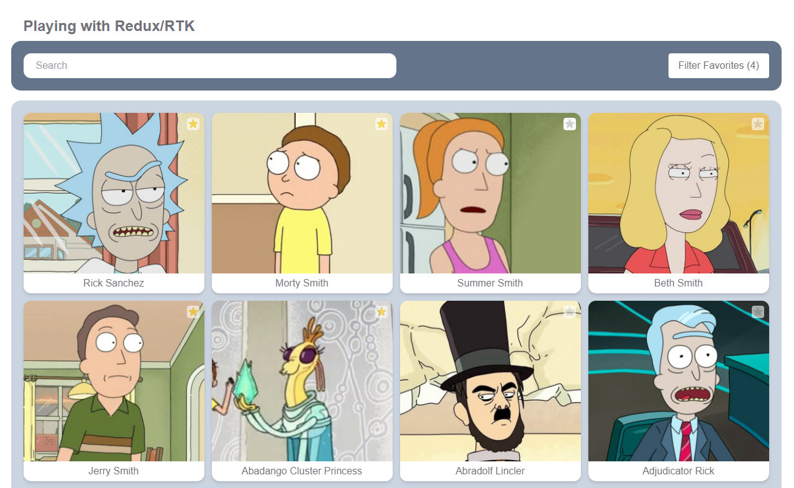

## Project

Playing with React, Redux Toolkit and Redux Toolkit Query. I explored different Redux approches for the same project, so each branch has the same project/layout, but implemented in a different way.

Features: Connect to [Rick and Morty's REST API](https://rickandmortyapi.com/api/), list, paginate, filter and like characters.

<p style="text-align: center">
  
</p>

This project was created for study purposes.

## Branches

<table>
  <tbody>
    <tr>
        <td>Setup/Layout</td>
        <td>Vite</td>
        <td>TypeScript</td>
        <td>Tailwind</td>
        <td>-</td>
    </tr>
    <tr>
        <td>Main</td>
        <td>Redux Toolkit</td>
        <td>Fetch w/ RTK Query</td>
        <td>Redux Persist</td>
        <td>-</td>
    </tr>
    <tr>
        <td>RTK</td>
        <td>Redux Toolkit</td>
        <td>Fetch w/ Redux Thunk</td>
        <td>-</td>
        <td>-</td>
    </tr>
    <tr>
        <td>RQ-AND-RTK</td>
        <td>Zustand</td>
        <td>React Query (TanStack)</td>
        <td>React Router</td>
        <td>Axios</td>
    </tr>
  </tbody>
</table>

The RQ-AND-RTK branch is an awesome collaboration from [yuribmontez](https://github.com/yuribmontez) and has both, RTK Query and Zustand + React Query approaches.

### Getting Started

- Install dependencies

```bash
npm install
```

- Start the project
```bash
npm run dev
```

## Contribute

- Fork this repository
- Create a branch with your feature: `git checkout -b my-feature`
- Commit your changes: `git commit -m 'feat: add my new feature'`
- Push it to your branch: `git push origin my-feature`

After merging your pull request, your branch can be deleted.

Check the details about the types, verbs and commit messages here [CONTRIBUTING.md](./.github/CONTRIBUTING.md)

Also check the [CODE_OF_CONDUCT.md](./.github/CODE_OF_CONDUCT.md)

## License

This project is [MIT Licensed](./LICENSE)
